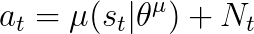
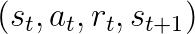
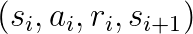
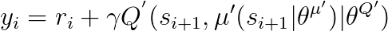
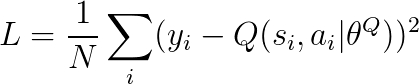
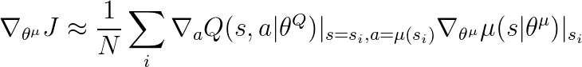
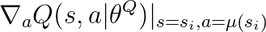
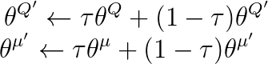
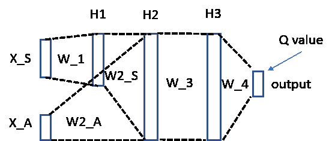
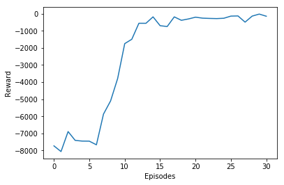

## Overview

In this project, we implement Deep Deterministic Policy Gradient ([DDPG](https://arxiv.org/abs/1509.02971)) from scratch (using Numpy only), without using DL framework such as Tensorflow.
## DDPG

### Key steps in DDPG

In the following, the key steps and their corresponding code snippets are listed. The DDPG algorithm is implemented in ```ddpg_numpy.py```

1) Select action a\_t according to current policy and exploration noise



```
a_t = actor.predict(np.reshape(s_t,(1,3)), ACTION_BOUND, target=False)+1./(1.+i+j)
```
2) Execute action a\_t and observe reward r\_t and observe new state s\_{t+1}



```
s_t_1, r_t, done, info = env.step(a_t[0])
```
3) Create and sample from replay buffer



4) Set y_i according to the following equation:



```
y=np.zeros((len(batch), action_dim))
a_tgt=actor.predict(states_t_1, ACTION_BOUND, target=True)
Q_tgt = critic.predict(states_t_1, a_tgt,target=True)
for i in range(len(batch)):
    if dones[i]:
        y[i] = rewards[i]
    else:
        y[i] = rewards[i] + GAMMA*Q_tgt[i] 
```

5) Update the critic network by the loss function



```
loss += critic.train(states_t, actions, y)
```
6) Update the actor policy using the sampled policy gradient:



which needs the input of  




```
dQ_da = critic.evaluate_action_gradient(states_t,a_for_dQ_da)
```

which in turn relies on $a=\mu(s_i)$:

```               
a_for_dQ_da=actor.predict(states_t, ACTION_BOUND, target=False)
```

Finally, the following code implements the actor policy update:

```
actor.train(states_t, dQ_da, ACTION_BOUND)

```

7) Update target networks



```
actor.train_target(TAU)
critic.train_target(TAU)
```
                
### Actor (policy) Network
The actor network is implemented in ```actor_net.py ```.

### Critic (value) Network     
The critic network is implemented in ```critic_net.py ```. We note that we follow the implementation as mention in [DDPG paper](https://arxiv.org/abs/1509.02971). The following sketch shows the architecture of the critic network.


### Results

  

## Acknowledgement 
In the process of the coding, I am informed and inspired by the coding practice, style, technique in the following Github repository (https://github.com/yanpanlau/DDPG-Keras-Torcs, http://cs231n.github.io/assignments2017/assignment2/).
        


